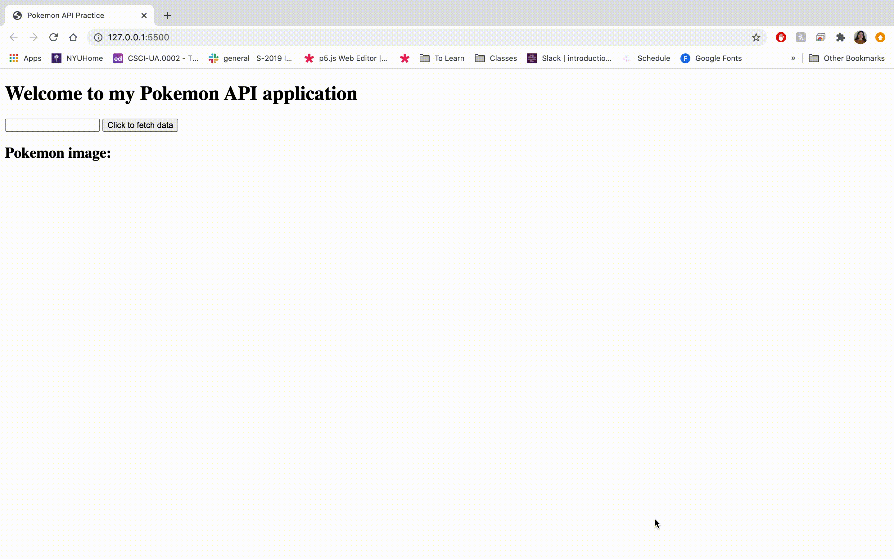

# Instructions

Goal: When the user enters the name of a pickachu in the textbox and clicks the button, fetch the image of the corresponding pikachu from the pokemon API and add it to the page. Change the text in the paragraph to the name of the pokemon the user just entered. If the user enters a pokemon that doesn't exist, nothing happens.

1. Download this repository.
2. Read over the index.html to understand how the website is structured.
3. Read the [pokemon API](https://pokeapi.co/) documentation to see how it works. You will need to work with JSON and access the "front_default" property within the object that holds the image of the pokemon.
4. Without changing the index.html, add your code in main.js to program your website to perform as above.